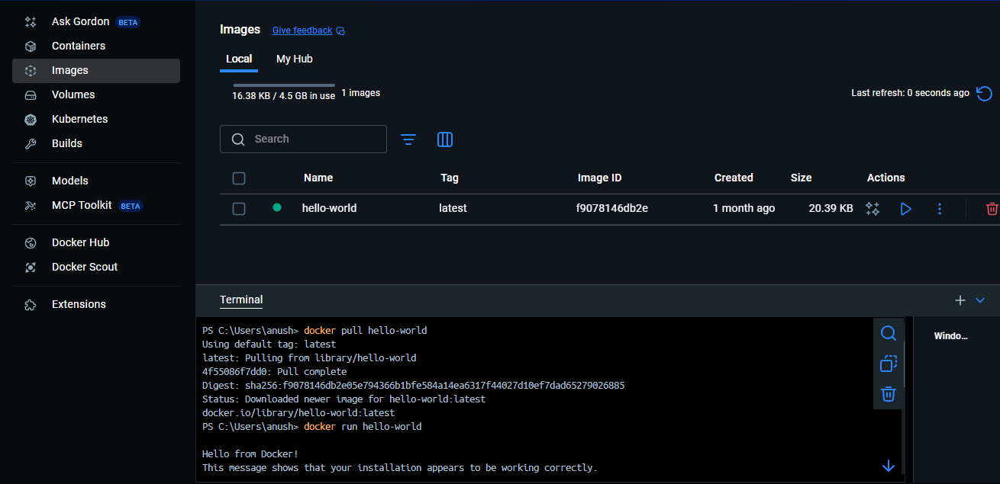
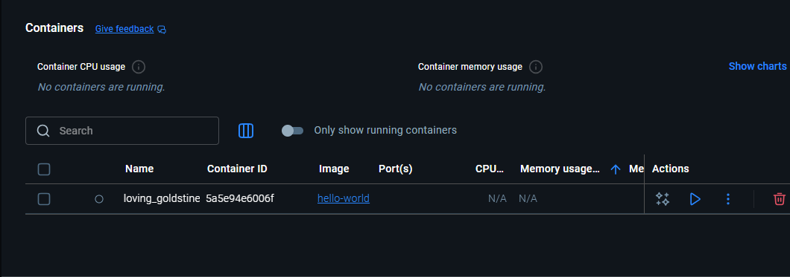
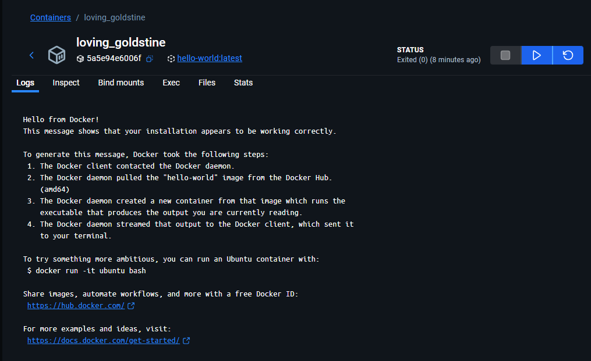
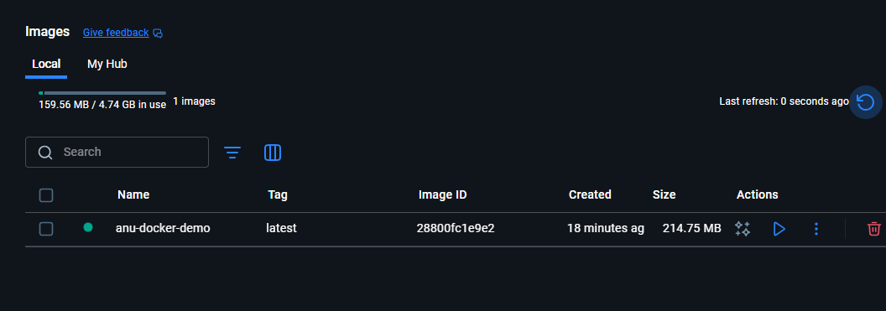
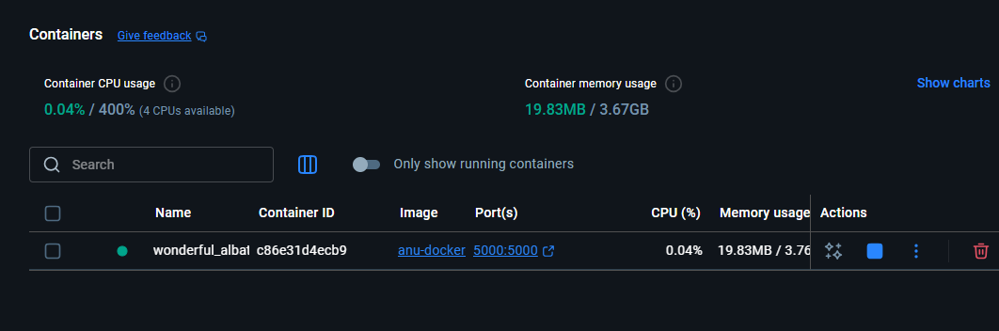
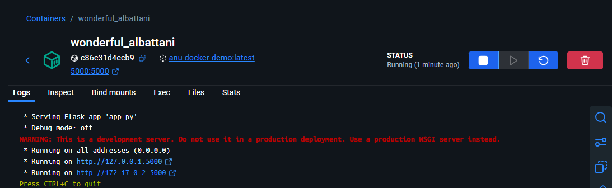
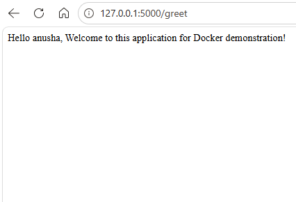
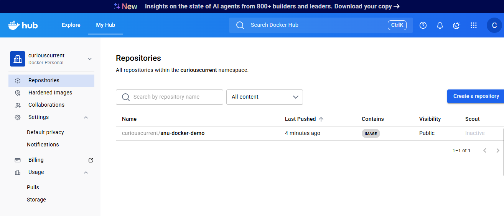
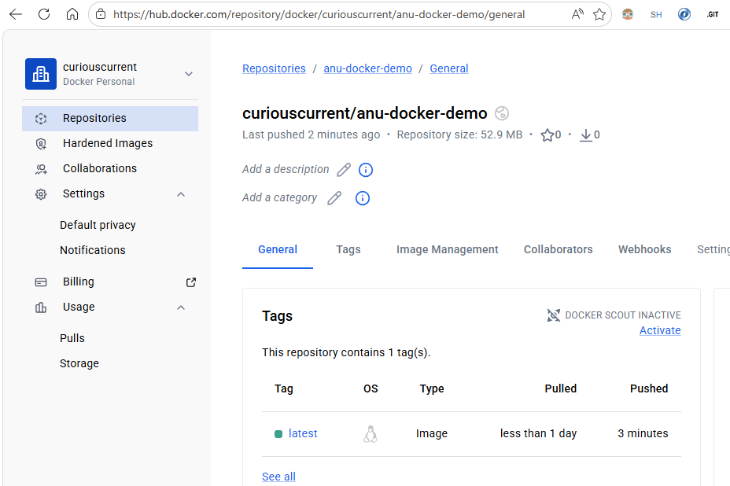

# docker-mlops
# MAIN STEPS
1. Create app.py (flask application file)
2. create requirements.txt file for dependencies
3. Create dockerfile

# STEP BY STEP 

1. Pulled hello-world docker image from Docker Hub, using the command (Check Images)
```
docker pull hello-world
```

2. Run the hello-world docker image using the command (Check Containers)
```
docker run hello-world
```


3. Now create Docker image using the command 
```
docker build -t <img_name> .
```
4. Run the Docker image using the command 
```
docker run -p 5000:5000 <img_name> 
```
5. Tag your image before pushing to Docker Hub (for different development phases)
```
docker tag <img_name> <dockerhub_username>/<img_name>:<version>
```
6. Push the docker image to docker hub
```
docker push <dockerhub_username>/<img_name>:<version>
```
7. Pull the docker image from the docker hub
```
docker pull <dockerhub_username>/<img_name>:<version>
```
8. Run the pulled image
```
docker run -p 5000:5000 <dockerhub_username>/<img_name>:<version>
```

# OUTPUTS






