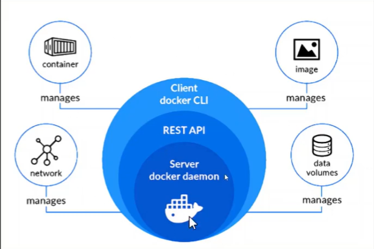
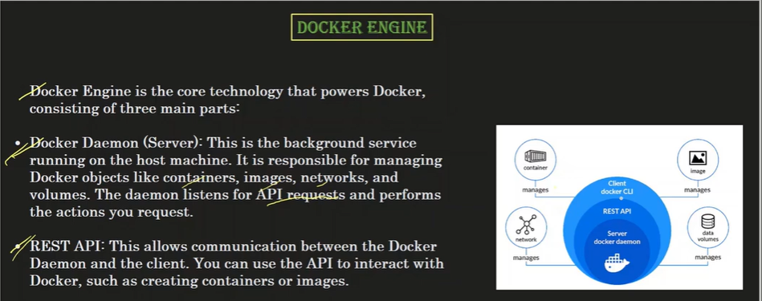
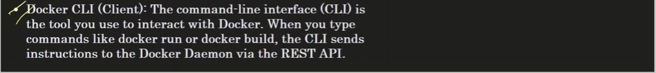
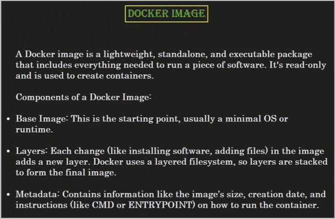
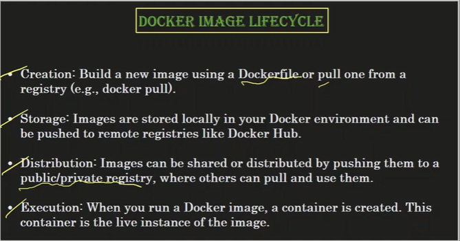
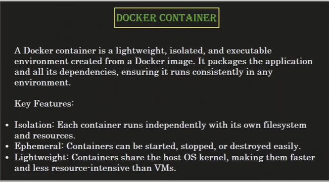

Container - An application deployed on a server using Docker.

# Difference between Image and Container 

1. When you run a docker image -> it is called a container. 

# Port mapping 

Mapping the Docker image port to the port of the local system/server. 

# Docker Engine

# Docker Image

# Docker Image LifeCycle

# Docker Container

# Alternative options to dockerhub (For pushing docker images, etc)
AWS - ECR , Azure 