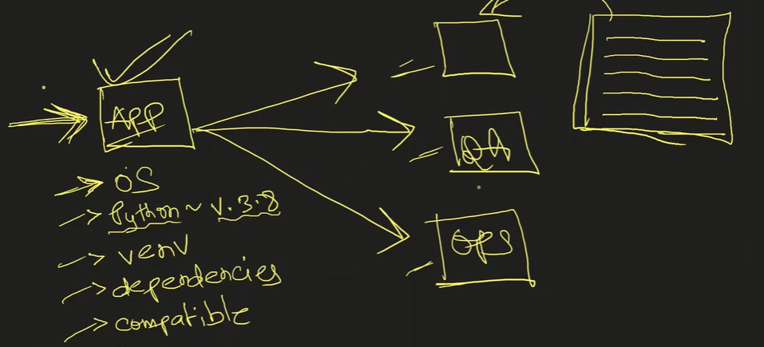
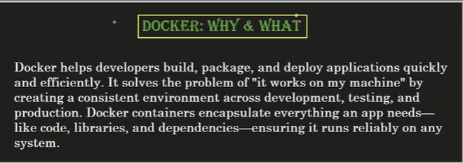
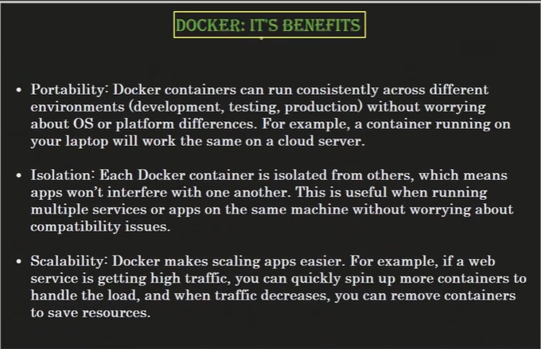
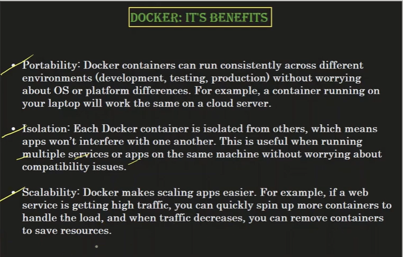
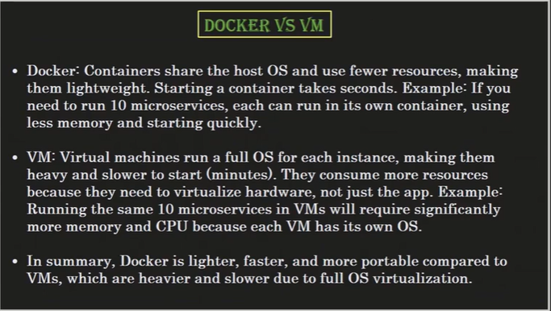
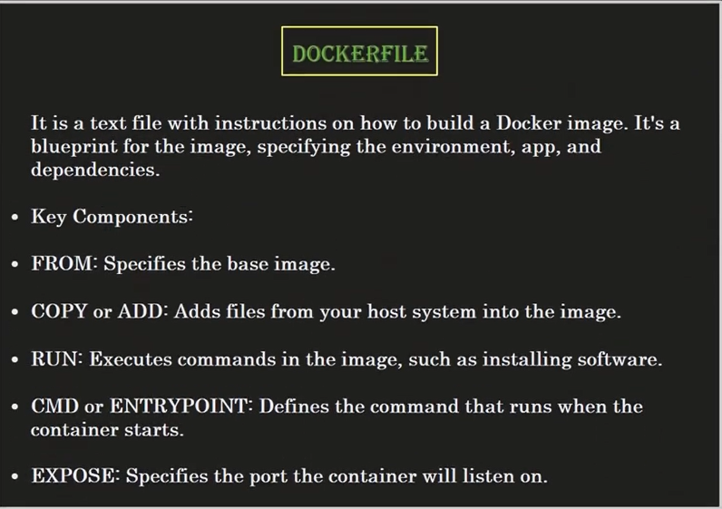
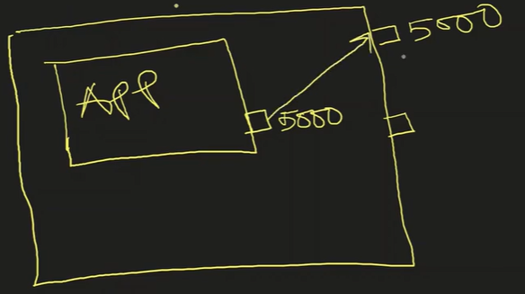

Container - An application deployed on a server using Docker.

# Difference between Image and Container 

1. When you run a docker image -> it is called a container. 

# Port mapping 

Mapping the Docker image port to the port of the local system/server. 